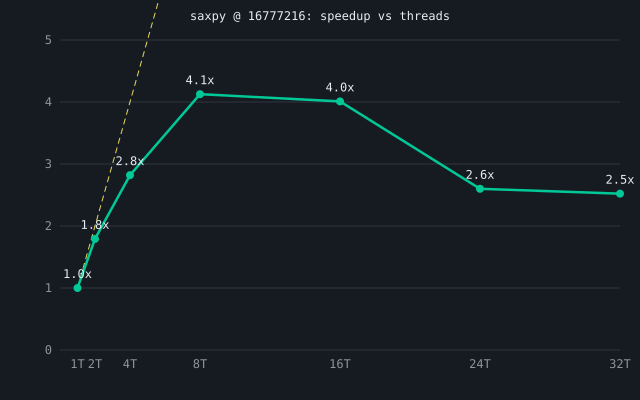
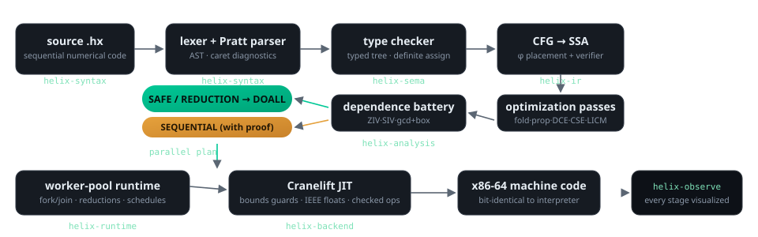
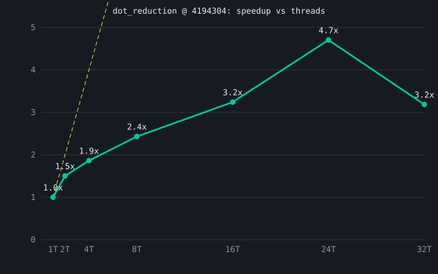
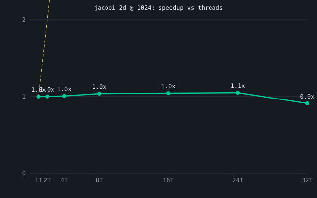

<div align="center">

# HELIX Lite

**An automatic parallelizing compiler that shows you the proof.**

Write ordinary sequential numerical code. HELIX proves which loops are safe to run
on all your cores — and shows you the dependence analysis behind every verdict.



</div>

```helix
fn main() {
    let n = 50000000;
    let a: [f64] = zeros(n);
    let out: [f64] = zeros(n);
    for i in 0..n {
        out[i] = a[i] * 5.0 + 1.0;
    }
}
```

```
$ helix loops examples/scale.hx
==== main loop analysis ====
Loop #1: RAW 0 / WAR 0 / WAW 0 => SAFE
    READ a[i]
    WRITE out[i]

$ helix loops examples/recurrence_reject.hx
==== main loop analysis ====
Loop #1: RAW 1 / WAR 0 / WAW 0 => SEQUENTIAL (RAW a[i] <- a[i - 1] (carried by iteration distance 1, level 1))
    READ a[i - 1]
    WRITE a[i]
```

A loop that *can* be proven independent is parallelized across every core.
A loop that carries a dependence — like the recurrence above — is **refused,
with the exact distance and direction printed as evidence**.

---

## The pipeline



source → lexer → Pratt parser → AST → type checker → CFG IR → SSA (semi-pruned,
CHK dominators) → constant folding/propagation · copy-prop · DCE · CSE · LICM →
loop detection → **dependence battery (ZIV · SIV family · gcd+bounded-box)** →
parallelization (DOALL + reduction recognition) → Cranelift → x86-64 machine code.

Every stage is inspectable: `helix dump tokens|ast|ir|ssa`, or the whole pipeline
stepped through visually in the Observatory (`helix observe`).

## Measured results (laptop, 2026-08-25)

| Claim | Number |
|---|---|
| saxpy @16.8M f64, parallel speedup | **4.13× @ 8 threads** (bandwidth-bound) |
| dot-product reduction | **4.7× @ 24 threads** |
| matmul 128², interpreter → native JIT | **251×** |
| recurrence loop | **refused** — RAW distance-1 proven, runs sequential |
| cross-backend correctness | every example bit-identical interp ≡ JIT |

Full tables + methodology: [docs/benchmarks/results.md](docs/benchmarks/results.md).

### Speedups at a glance

| dot product @4.2M | jacobi stencil @1024² |
|---|---|
|  |  |

*(15 measured kernels × sizes live in [`docs/benchmarks/figs/`](docs/benchmarks/figs).)*

## Try it

```bash
cargo run --release -p helix-cli -- observe     # the Observatory web UI
helix run examples/saxpy.hx                     # interpreter
helix run --backend jit examples/saxpy.hx       # JIT (identical output)
helix selftest                                  # differential gauntlet
```

Handy controls:

```bash
helix run --backend jit --threads 4 examples/saxpy.hx   # pin the thread count
helix bench --quick                                     # fast benchmark pass
HELIX_SCHEDULE=guided helix run --backend jit f.hx      # pick the schedule
```

## Layout

| Path | What |
|---|---|
| crates/helix-syntax | lexer + parser + AST |
| crates/helix-sema | types, scopes, static checks |
| crates/helix-ir | CFG IR, SSA, optimization passes + verifier |
| crates/helix-analysis | loops, dependence battery, parallelization plans |
| crates/helix-backend | Cranelift lowering + JIT engine + parallel regions |
| crates/helix-runtime | worker pool, schedules, reductions |
| crates/helix-engine | reference interpreter |
| crates/helix-bench | benchmark harness + kernel suite |
| crates/helix-observe | Observatory artifact builder + server |
| docs/ | lab notebook: research digests, decisions, notes, benchmarks, report outline |
| examples/*.hx | demo programs incl. deliberately rejected loops |

License: MIT
